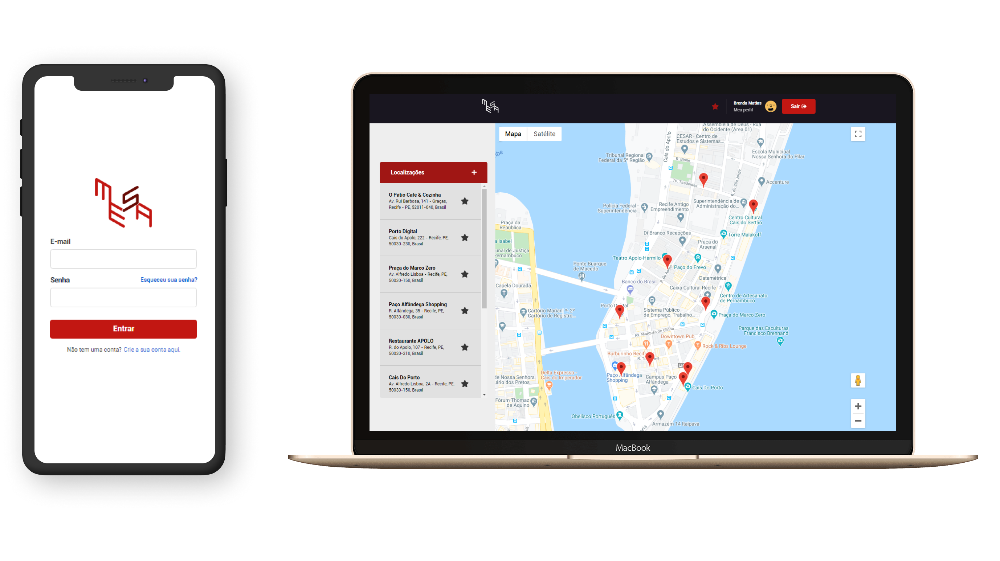

<h1 align="center">
    Mesa Inc :round_pushpin:
</h1>

<h4 align="center">
  Code and coffee ☕
</h4>

  <a href="#ghost-tecnologias">Tecnologias</a>&nbsp;&nbsp;&nbsp;|&nbsp;&nbsp;&nbsp;
  <a href="#computer-projeto">Projeto</a>&nbsp;&nbsp;&nbsp;|&nbsp;&nbsp;&nbsp;
  <a href="#rocket-iniciando-aplicação">Iniciando aplicação</a>&nbsp;&nbsp;&nbsp;|&nbsp;&nbsp;&nbsp;
  <a href="#door-back-end">Back-end</a>&nbsp;&nbsp;&nbsp;|&nbsp;&nbsp;&nbsp;
  <a href="#art-front-end">Front-end</a>

 

  

## :ghost: Tecnologias

Esse projeto foi desenvolvido com as seguintes tecnologias:

- [Vue.js](https://vuejs.org/)
- [Node.js](https://nodejs.org/en/)
- [AdonisJS](https://adonisjs.com/)
- [Docker](https://docs.docker.com/)
- [Postgres](https://www.postgresql.org/)

## :computer: Projeto

O projeto consiste em uma aplicação que visa disponibilizar as localizações mais próximas aos usuários autenticados, onde as mesmas podem ser cadastradas e avaliadas pelos usuários, possibilitando assim um compartilhamento de experiências dentro da aplicação.

## :rocket: Iniciando aplicação

- Clone este repositório usando `git clone git@github.com:brendamatias/mesa-inc.git`;
- Mova-se para diretório da aplicação: `cd mesa-inc`;

## :door: Back-end

- Mova-se para diretório da aplicação back-end: `cd backend`;
- Crie e inicie o container e o banco de dados: `docker-compose up -d`
- Execute `yarn install` ou `npm install` para instalar as dependências;
- Duplique o arquivo `.env.example` para `.env` para leitura das variáveis;
- Execute o seguinte comando para executar as migrações: `adonis migration:run`
- Execute as seed da aplicação: `adonis seed`
- Inicie a aplicação: `adonis serve --dev`

## :art: Front-end

- Mova-se para diretório da aplicação front-end: `cd frontend`;
- Execute `yarn install` ou `npm install` para instalar as dependências;
- Inicie a aplicação com `yarn serve` ou `npm serve`;

---

### <a href="https://www.linkedin.com/in/brenda-matias/">LinkedIn</a>
